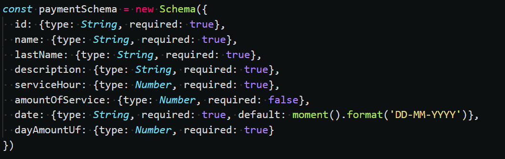
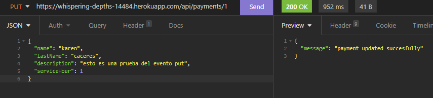
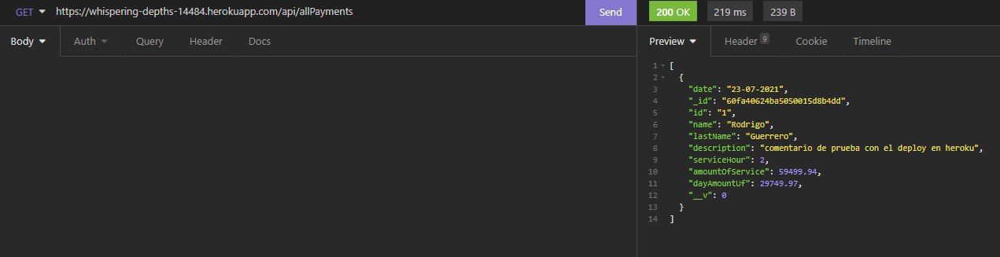
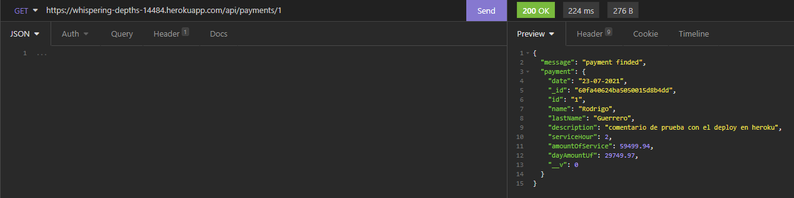
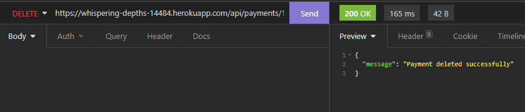
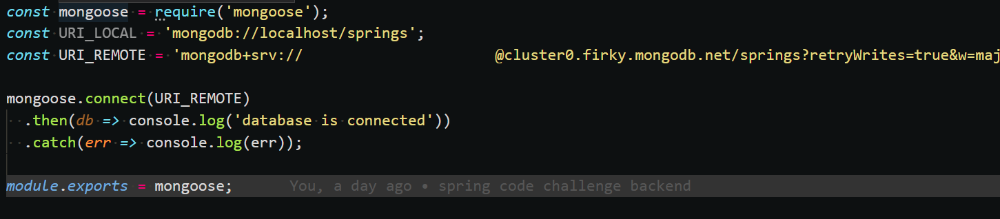

# 👨‍💻 Code Challenge Springs Digital - Backend

Para el desafio se realizó una aplicación web backend, el cual devolverá los datos especificados para el code challenge de springs digital, se debe de destacar dos dependencias las cuales son: moment el cual estará encargado de solicitar las fechas y entregarlas en un formato valido para la API de https://mindicador.cl y node-fetch, el que podra realizar la conexion y solicitud de datos a la API mencionada anteriormente.

Cabe mencionar que la app web se encontrará alojada en heroku para que se puedan realizar las respectivas pruebas mediante el link que se podrá visualizar en el about del repositorio, debido a que se ha necesitado de una base de datos online, en caso de que se requiera descargar el repositorio y utilizar una base de datos local, se debe cambiar una variable en el archivo database.js.

## ✨ Tecnologias
- express
- mongoDB
- mongoose
- morgan
- moment
- node-fetch

## 🦾 Mongoose Schema

## 🦾 POST

Para el post son necesarios los siguientes datos: id, name, lastName, description, serviceHour, el valor dayAmountUf se obtiene al realizar la peticion fetch a la API https://mindicador.cl/, el valor date, se obtiene con la dependencia moment el cual captura la fecha del día que se realizá la petición POST y finalmente el valor amountOfService es el calculo obtenido por el valor de la Uf por las horas indicadas la peticion POST.

## 🦾 GET - all payments

## 🦾 GET - one payment

## 🦾 PUT

## 🦾 DELETE

## 🦾 Database

Como se mencionó anteriormente si se desea utilizar la app de forma local, se debe cambiar en el archivo database.js la variable URI_REMOTE por URI_LOCAL, obviamente se deberá contar con una base de datos mongoDb en el computador que se desea ejecutar la API.

